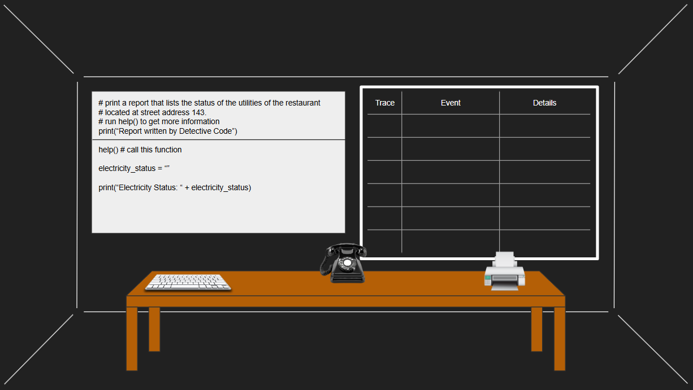
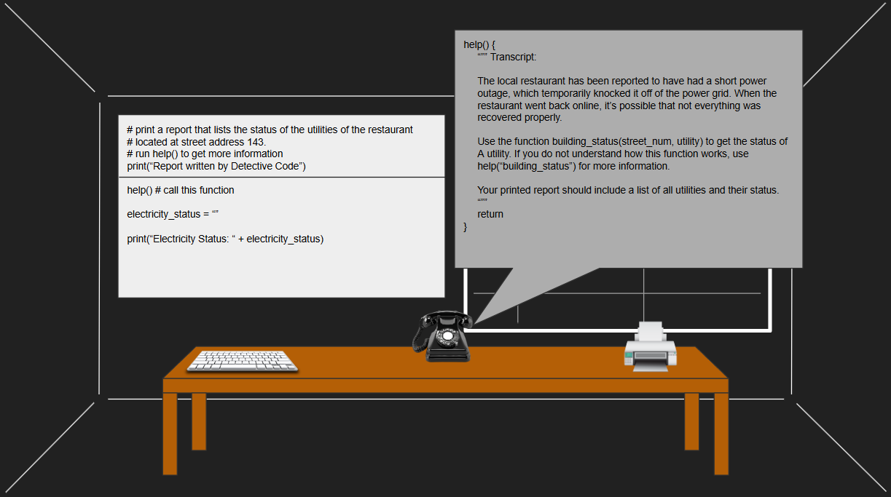
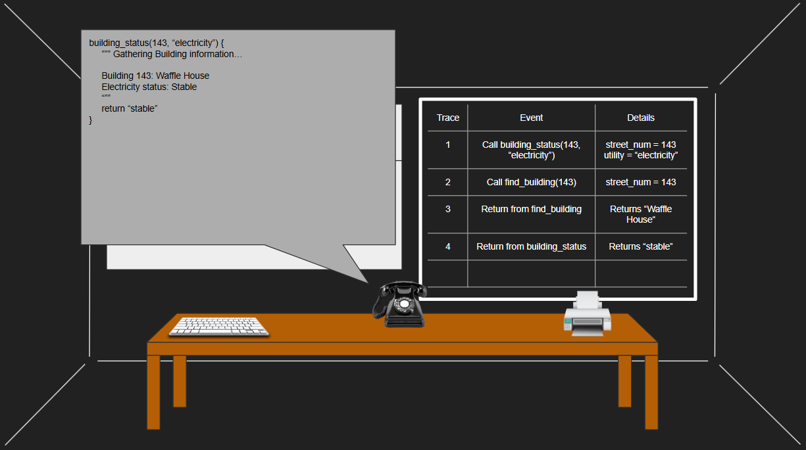
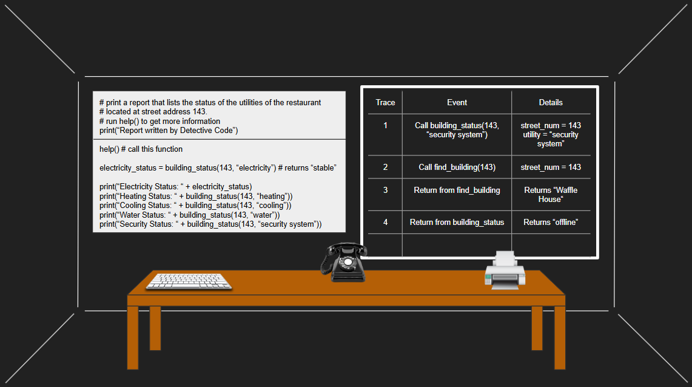
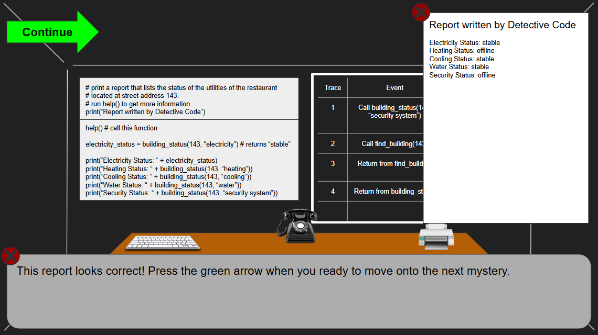

# Detective Code

## Elevator Pitch

A level-based game where players solve puzzles involving searching through python programs & learn how to properly call functions. 

## Influences (Brief)

- Human Resource Machine:
  - Medium: Game
  - Explanation: Human Resource Machine teaches programming logic through small puzzle challenges where players must carefully think through how instructions execute step by step. This game influences the design by emphasizing reasoning about program flow and execution order, similar to tracing function calls in a program.

- Programming Debuggers:
  - Medium: Software Tool
  - Explanation: Debugging tools in programming environments allow programmers to step through code and observe the call stack as functions are entered and exited. This game is influenced by that process, encouraging students to simulate the same step-by-step reasoning when tracing function calls and returns.
    
## Core Gameplay Mechanics (Brief)

- Select which function is called next in the execution order.
- Indicate when a function returns.
- Identify parameter values passed into a function.
- Identify return values produced by a function.
- Place functions into a visual call stack to represent nested function layers.
- Keep track of how deep a nested function goes.

# Learning Aspects

## Learning Domains

- Computer Science: specifically programming fundamentals and program execution.

- Computational Thinking: decomposition, sequencing, and logical reasoning when following code execution.

## Target Audiences

Students or the people who want to learn how to trace functions in program.

## Target Contexts

This learning activity or game can be used in introductory programming courses such as high school AP Computer Science classes, introductory college computer science courses, or coding bootcamps. It is also suitable for guided practice in computer labs, homework exercises, and interactive learning games that reinforce program tracing. Informally, it could be used by self-learners studying programming concepts, coding clubs, or students practicing for exams that assess understanding of function calls and program execution.

## Learning Objectives

- By the end of the lesson, students will be able to trace function calls using computational thinking.
- By the end of the lesson, students will be able to create function calls with a debugger in mind.
- By the end of the lesson, students will be able to recognize the order of functions that are being executed.

## Prerequisite Knowledge

- Prior to the game, players need to be able to define the concept of function structure.
- Prior to the game, players need to be able to explain the variable in function.
- Prior to the game, players need to be able to demonstrate proper algorithmic thinking at the most basic level.

## Assessment Measures

A short pre-test and matching post-test should be designed to assess student learning of tracing function calls and returns in a program.

- Given a program with multiple functions, identify the order in which the functions are called during execution.
- Given a program with nested function calls, identify which function is currently on the top of the call stack at a specific point in execution.
- Given a function call with parameters, identify the values passed into the function.

### Examples of Assement Questions:
The following assement question are ordered in difficulty from easiest to hardest to give a range of difficulty. This type of question could technically be written in any type of programming language as long as it has function calls, but these questions will be written in python as this is closer to introductory course level questions

### Question 1: Invocation Order Only 

Given the following python program, trace the order in which the functions are invoked.

```
def greet(name):
    return "Hello " + name

def farewell(name):
    return "Goodbye " + name

def run():
    first = greet("Alice")
    second = farewell("Alice")
    return first + " and " + second

run()
```

|Trace #|Event                                   |Details                                 |Depth|
|-------|----------------------------------------|----------------------------------------|-----|
|1      |                                        |                                        |     |
|2      |                                        |                                        |     |
|3      |                                        |                                        |     |

Answer:
|Trace #|Event                                   |Details                                 |Depth|
|-------|----------------------------------------|----------------------------------------|-----|
|1      |Call run()                              |no parameters                           |1    |
|2      |Call greet("Alice")                     |name = "Alice"                          |2    |
|3      |Call farewell("Alice")                  |name = "Alice"                          |2    |

### Question 2: Entry & Exit Trace

Given the following python program, trace the complete call stack, recording both when the functions are invoked and when they return.

```
def add(a, b):
    return a + b

def multiply(x, y):
    result = add(x, y)
    return result * 2

call = multiply(3, 4)
```

|Trace #|Event                                   |Details                                 |Depth|
|-------|----------------------------------------|----------------------------------------|-----|
|1      |                                        |                                        |     |
|2      |                                        |                                        |     |
|3      |                                        |                                        |     |
|4      |                                        |                                        |     |

Answer:
|Trace #|Event                                   |Details                                 |Depth|
|-------|----------------------------------------|----------------------------------------|-----|
|1      |Call multiply(3, 4)                     |x = 3, y = 4                            |1    |
|2      |Call add(3, 4)                          |a = 3, b = 4                            |2    |
|3      |Return from add                         |returns 7                               |1    |
|4      |Return from multiply                    |result = 7, returns 14                  |0    |

### Question 3: Recursion Trace

Given the following python program, trace the complete call stack, recording both when the functions are invoked and when they return.

```
def factorial(n):
    if n == 1:
        return 1
    return n * factorial(n - 1)

result = factorial(4)
```

|Trace #|Event                                   |Details                                 |Depth|
|-------|----------------------------------------|----------------------------------------|-----|
|1      |                                        |                                        |     |
|2      |                                        |                                        |     |
|3      |                                        |                                        |     |
|4      |                                        |                                        |     |
|5      |                                        |                                        |     |
|6      |                                        |                                        |     |
|7      |                                        |                                        |     |
|8      |                                        |                                        |     |

Answer:
|Trace #|Event                                   |Details                                 |Depth|
|-------|----------------------------------------|----------------------------------------|-----|
|1      |Call factorial(4)                       |n = 4                                   |1    |
|2      |Call factorial(3)                       |n = 3                                   |2    |
|3      |Call factorial(2)                       |n = 2                                   |3    |
|4      |Call factorial(1)                       |n = 1                                   |4    |
|5      |Return from factorial(1)                |returns 1                               |3    |
|6      |Return from factorial(2)                |returns 2                               |2    |
|7      |Return from factorial(3)                |returns 6                               |1    |
|8      |Return from factorial(4)                |returns 24                              |0    |

# What sets this project apart?

- Focus on a Difficult Programming Concept  
  Many beginner programming games focus on simple sequencing or syntax, but few directly teach how function calls, returns, and the call stack work together during program execution. This game targets a concept that many students struggle with in introductory programming courses, helping them build a clear mental model of how programs actually run.

- Interactive Program Tracing Instead of Passive Learning  
  Rather than reading explanations or watching tutorials, players actively step through program execution. By selecting which function is called next, identifying return values, and maintaining a call stack, players learn through hands-on interaction that mimics real debugging and program analysis.

- Visualizing an Invisible Process  
  The call stack and function execution are normally invisible processes happening inside the computer. This game makes them visual and interactive, allowing players to see functions enter and exit the stack. This visualization helps learners better understand nested functions and program flow.

# Player Interaction Patterns and Modes

## Player Interaction Pattern

This is a game for one person, they click with the mouse/type with the keyboard.

## Player Modes

- Single-player: You repeatedly advance through rounds and levels until you reach the end.

# Gameplay Objectives

- Primary Objective #1:
  - Description: Identify the order in which functions are called when a program begins execution.
  - Alignment: This aligns with the learning objective of tracing function calls, helping students practice recognizing when functions are invoked from the main program or from other functions.

- Primary Objective #2:
  - Description: Determine the order in which functions return and what values they return.
  - Alignment: This aligns with the learning objective of tracing function returns and understanding how return values move back through the call stack.

- Primary Objective #3:
  - Description: Identify the current layer of nested function calls while tracing program execution.
  - Alignment: This supports the learning objective of understanding the call stack and nested function behavior during program execution.

# Procedures/Actions

Players interact with the game by analyzing short programs and writing out the correct steps that occur during program execution. The player reads a displayed program and then uses on-screen buttons or draggable elements to indicate when a function is called, when a function returns, and what values are passed or returned.

# Rules

Players are given a short program and must correctly trace the order of function calls and returns. The player must complete the trace before the program finishes executing.

# Objects/Entities

- Program Display:
  - Shows the code that the player must analyze and trace. The program includes functions, parameters, and return statements that players must follow during execution.

- Function Nodes:
  - Represent individual functions in the program. These can be highlighted or selected when a function is called or returned during gameplay.

## Core Gameplay Mechanics (Detailed)

- Core Gameplay Mechanic #1: Function Call Tracing  
  Players analyze a short program and determine which function is called next in the execution order. The game pauses at specific points in the program and presents multiple possible functions that could be invoked. The player must select the correct function based on the current line of code.

  When the player selects a function call, the game advances execution and visually shows that function being entered. This mechanic reinforces the skill of recognizing where functions are invoked and understanding how program execution moves from one function to another.

- Core Gameplay Mechanic #2: Return Value Identification  
  When a function finishes executing, the player must identify when the function returns and what value is returned to the previous function. The game prompts the player to choose the correct return value or confirm the function that is exiting.

  This mechanic helps players understand how functions complete their work and pass information back to the calling function. It reinforces the concept of return statements and the flow of data through a program.

- Core Gameplay Mechanic #3: Call Stack Construction  
  Players build and maintain a visual representation of the call stack as the program runs. Each time a function is called, the player places it onto the stack, representing a new layer of nested function execution. When a function returns, the player removes it from the stack.

  This mechanic helps players understand how nested function calls work and how the call stack changes during execution. By physically placing and removing functions from the stack, players develop a clearer mental model of how programs manage multiple active function calls.

    
## Feedback

Players receive immediate feedback through visual cues when they make tracing decisions. When a player correctly selects the next function call, the selected function is highlighted and animated as it moves onto the visual call stack. If the player correctly identifies a function return, the function smoothly pops off the stack with a confirmation sound or animation. Incorrect selections are indicated with a brief red highlight or shake animation, prompting the player to reconsider the step. These visual and audio signals help players recognize whether they are correctly identifying function calls, returns, parameters, and stack behavior.

The call stack visualization itself also acts as continuous feedback. As players add or remove functions from the stack, they can see how nested function layers change during execution. This helps reinforce the concept of program flow and allows players to monitor their progress toward correctly tracing the program.

Longer-term feedback is provided through a scoring and progress system. After completing a level, players receive a summary showing how many tracing steps were correct, how many hints were used, and which types of tracing actions they struggled with (such as identifying returns or parameters). Over multiple levels, the game tracks accuracy and improvement toward the learning objective of tracing function calls with at least 80% accuracy. This progress tracking helps players understand how their skills are developing and encourages continued practice.

# Story and Gameplay

## Presentation of Rules

Players learn the mechanics through short interactive tutorials that introduce one concept at a time. The first level guides the player to identify the main entry point of a program and select the first function call. Visual prompts highlight the correct part of the code and briefly explain the action the player should take.

As players progress, new mechanics are gradually introduced, such as identifying return values and managing the call stack. Instead of long explanations, the game uses small hints, visual highlights, and example moves to demonstrate the correct actions. Each new mechanic appears in a simple level first before being combined with other mechanics in later challenges.

## Presentation of Content

The programming concepts are taught through practice with small programs that gradually increase in complexity. Early levels use very short programs with only one or two functions so players can clearly see how execution moves between them.

Later levels introduce nested function calls, parameters, and return values. Visual tools such as the call stack and highlighted code lines help players understand what is happening during execution. By repeatedly tracing programs in an interactive way, players build a stronger mental model of how functions work together during program execution.

## Story (Brief)

The player takes the role of a beginner Detective solving short mysteries and other problems. However, it seems as though all of the information he gathers about these mysteries have been translated into coding languages, including the reports he is given & even the speech of the people he talks to. Act as a computer program, scan through lines code, & take notes along the way to find the truth!

## Storyboarding

This first image is a basic layout of your character's working space. There is a projector on the left that the player will be working with, & a blackboard on the right. On the table is a keyboard, an old telephone & a printer. The player can click on either the keyboard or the bottom half of the smartboard to access the python terminal, allowing them to write function calls & print statements to try to solve the puzzle (note that the top half of the smartboard is a read only, meaning it is unaccessible to the player, but it gives a brief overview of the task, as well as the list of predefined variables).

[](https://github.com/ccchip1/Educational-Game-Developent-Project-Detective-Code/blob/main/Detective_Code_StoryBoard_Version2.1.png)


When the player clicks the phone at the center of the table, it will show a dialogue message based off of the function they choose. This is what we will call a "Function Phone Call". In order for someone to do a function phone call correctly, the text cursor in the terminal needs to be positioned specifically on top of the name of the function they want to call.

The next image shows the function help() being called on the telephone. The help() function is meant to act as the starting place for every puzzle as it gives a proper transcript of the puzzle they need to solve, including some of the functions they can use, & the expected print output for the report.

[](https://github.com/ccchip1/Educational-Game-Developent-Project-Detective-Code/blob/main/Detective_Code_StoryBoard_Version2.2.png)


Shown in the previous image, help() tells the player about a function called building_status() which will be used for solving the puzzle, & they are also told to call help("building_status") if they need help on how to properly use that function. The next image shows what function phone calling help("building_status") would look like.

[](https://github.com/ccchip1/Educational-Game-Developent-Project-Detective-Code/blob/main/Detective_Code_StoryBoard_Version2.3.png)


The next image shows the player calling the building_status() function properly thanks to the help of the help() function. This building_status() function does the typical dialogue in the function phone call, but it also shows the value that is being returned. Also on the smartboard, the player chooses to set that function call to a variable to then put in the print() statement.

[](https://github.com/ccchip1/Educational-Game-Developent-Project-Detective-Code/blob/main/Detective_Code_StoryBoard_Version2.4.png)


It is important to mention that the word bubble from the function phone call is horizontally draggable, & that is because the following image shows that the blackboard that was behind it now has information about the most recent function as well. The blackboard will create a trace of this function in the form of a table that shows the order of when functions are called or returned, as well as extra information about what arguments are being used, or what values are being returned.

[](https://github.com/ccchip1/Educational-Game-Developent-Project-Detective-Code/blob/main/Detective_Code_StoryBoard_Version2.5.png)


Next slide shows the rest of the player's print() statements for solving the rest of the puzzle. Notice they choose to have the specific function calls directly inside of the print statement instead of creating a new variable each time.

[](https://github.com/ccchip1/Educational-Game-Developent-Project-Detective-Code/blob/main/Detective_Code_StoryBoard_Version2.6.png)


When the player clicks the printer on the right side of the table, it will first run the entire python program, then it will bring up a report that shows the expected output of the print() statements. A message box will then appear spanning the bottom of the screen that will comment on how they did. It will give a positive comment if the report looks correct, & if it doesn't it will give the player a hint on how to fix it.

In this final image, it is shown that the player submitted a good report, so they are prompted to click the green arrow that appeared when they are ready to move onto the next level.

[](https://github.com/ccchip1/Educational-Game-Developent-Project-Detective-Code/blob/main/Detective_Code_StoryBoard_Version2.7.png)

# Assets Needed

## Aethestics

In the style of a cartoony detective noire film, but with a subtle static filter.

## Graphical

- Characters List
  - Detective Code (main character)
  - Various Co-workers
  - Various Witness
- Textures:
  - Static filter
  - Old Timey Telephone
- Environment Art/Textures:
  - Models for Detective Code's Office 
  - Midnight crime scene


## Audio


*Game region/phase/time are ways of designating a particularly important place in the game.*

- Music List (Ambient sound)
  - Ace Attorney-like music for the title screen
  - Chill jazz music for the main gameplay loop
  
*Game Interactions are things that trigger SFX, like character movement, hitting a spiky enemy, collecting a coin.*

- Sound List (SFX)
  - Old phone sounds when using the phone: ringing sound, hangup sound
  - Paper ruffling sounds when you click on the papers to go to write down a trace


# Metadata

* Template created by Austin Cory Bart <acbart@udel.edu>, Mark Sheriff, Alec Markarian, and Benjamin Stanley.
* Version 0.0.3
